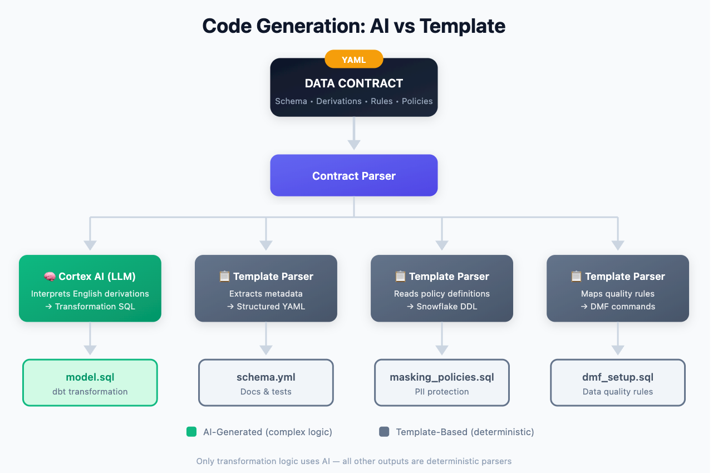
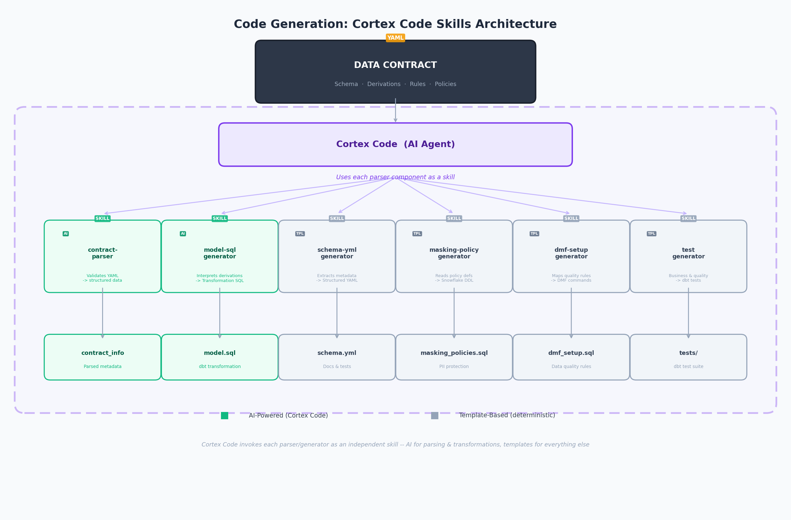

# Data Products for Financial Services

Build a production-ready **Retail Customer Churn Risk** data product on Snowflake — complete with AI-generated dbt models, masking policies, semantic views, and data quality monitoring.

This repo provides **two patterns** for building the same data product from a data contract. Choose the one that fits your team.

📝 **Blog Post:** [Building Enterprise Grade Data Products for FSI — Moving from Strategy to Tactics](https://datadonutz.medium.com/building-regulatory-grade-data-products-on-snowflake-for-fsi-938895e25e35) — covers the data product blueprint in detail

---

## Overview: Data Product Lifecycle

This repository follows a 5-stage lifecycle for delivering data products:

<p align="center">
  
</p>

| Stage | What Happens | Repo Folder |
|-------|--------------|-------------|
| **Discover** | Business event storms identify candidate data products | `01_discover/` |
| **Design** | Define specifications in a canvas, convert to a machine-readable data contract | `02_design/` |
| **Deliver** | Build data assets with code, metadata, and compute | `03_deliver/` |
| **Operate** | Monitor SLA, data quality, usage, and data drifts | `04_operate/` |
| **Refine** | Evolve with new features and versions | `05_refine/` |

---

## Two Patterns for Building Data Products

Both patterns start from the same data contract and produce the same data product. They differ in **how** code is generated and deployed.

| | **Pattern A: Streamlit App** | **Pattern B: Cortex Code** |
|---|---|---|
| **Interface** | Snowsight Streamlit UI | CLI / Terminal |
| **Code generation** | Paste contract into app, click Generate | Skills auto-generate from contract via prompts |
| **What gets generated** | dbt model SQL, schema.yml, masking policies | dbt model SQL, schema.yml, masking policies, DMFs, singular tests, deployment scripts |
| **Deployment** | Manual via Snowsight dbt Project + worksheets | `snow dbt deploy` + `snow dbt execute` |
| **Testing** | DMF setup via SQL script | 8 singular dbt tests + DMFs |
| **Governance** | Ad-hoc | `prompt.md` guardrails + Error Playbook |
| **Developer role** | Operator (copy-paste-run) | Reviewer (AI generates, you decide) |
| **Best for** | Quick demos, visual walkthroughs | Repeatable pipelines, team adoption, CI/CD |
| **Key files** | `03_deliver/01_dbt_generator_app.py` | `.cortex/skills/`, `PROMPT_INSTRUCTION_GUIDE.md` |

> Both patterns produce the same `RETAIL_CUSTOMER_CHURN_RISK` table with identical schema, masking, and quality rules.

### Architecture: LLM vs Agent

The two patterns represent two distinct AI architecture approaches for building data products from contracts.

**Pattern A — LLM (Single-pass generation)**

```
Contract YAML ──► Cortex LLM ──► Generated SQL
                  (one prompt)    schema.yml      ──► Manual deploy
                                  masking.sql          via Snowsight
                                  dmf_setup.sql
```

One prompt, one response. The contract is parsed, the LLM generates transformation SQL, and templates produce the rest. No memory between runs. No feedback loop. No governance artifacts.

**Pattern B — Agent (Multi-skill orchestration)**

```
Contract YAML ──► Cortex Code Agent
                       │
                  ┌────┴────────────────────────┐
                  │         7 Skills             │
                  │  ┌─────────┐  ┌───────────┐ │
                  │  │model-sql│  │ schema-yml│ │     prompt.md
                  │  │  (AI)   │  │ (template)│ │    (guardrails)
                  │  └─────────┘  └───────────┘ │        │
                  │  ┌─────────┐  ┌───────────┐ │        ▼
                  │  │masking  │  │ dmf-setup │ │   Plan ► Generate
                  │  │(template│  │ (template)│ │   ► Validate ► Deploy
                  │  └─────────┘  └───────────┘ │   ► Test ► Learn
                  │  ┌─────────┐  ┌───────────┐ │        │
                  │  │test-gen │  │ deployer  │ │        ▼
                  │  │(template│  │ (snow CLI)│ │   Error Playbook
                  │  └─────────┘  └───────────┘ │  (lessons persist)
                  └─────────────────────────────┘
```

The agent breaks the problem into steps, invokes the right skill for each artifact, validates outputs, deploys, and captures errors as reusable knowledge. Governance is codified. Lessons persist across sessions.

| | **LLM (Pattern A)** | **Agent (Pattern B)** |
|---|---|---|
| **Invocations** | 1 prompt → 1 response | N skills → N artifacts, iteratively |
| **AI usage** | LLM generates SQL + templates handle rest | LLM generates SQL only; templates handle 6 of 7 artifacts |
| **Memory** | None — stateless per run | `prompt.md` + Error Playbook persist across sessions |
| **Feedback loop** | None | Capture-feedback skill bakes lessons into guardrails |
| **Governance** | Implicit in app code | Explicit in `prompt.md` (forbidden patterns, naming rules) |
| **Iteration** | Re-run entire generation | Re-run individual skill |

---

## Common Setup (Both Patterns)

**Prerequisites:** The Discover and Design phases are assumed to be complete. Artefacts from these phases are available as the data product canvas (`01_discover/data_product_canvas.yaml`) and data contract (`02_design/churn_risk_data_contract.yaml`).

1. **Get the code** (choose one):
   - **Clone locally:**
     ```bash
     git clone https://github.com/srini86/data-products-lifecycle-fsi-example
     ```
   - **From Snowsight:** Projects → Worksheets → Create from Git Repository

2. **Run setup script** — Open `00_setup/setup.sql` in Snowsight:
   - Run **Steps 1–4** to create database, schemas, and sample data
   - Run **Step 5** to create the Streamlit app (only needed for Pattern A)
   - Run **Step 6** to verify all assets are created

After setup, choose your pattern below.

---

## Pattern A: Streamlit App

> **Use this pattern** for quick demos, visual walkthroughs, or when working entirely within Snowsight.

<p align="center">
  
</p>

### A1. Generate Data Product Code

1. Open the Streamlit app: Snowsight → **Projects** → **Streamlit** → `dbt_code_generator`
2. Choose an input method:
   - **Paste YAML:** Copy contents of `02_design/churn_risk_data_contract.yaml` and paste
   - **Load from Stage:** Enter stage path and filename
3. Click **Generate All Outputs**
4. The app generates:
   - `retail_customer_churn_risk.sql` — dbt model with transformation logic
   - `schema.yml` — dbt schema with documentation and tests
   - `masking_policies.sql` — Snowflake masking policies

> 💡 **Sample outputs** are available at `03_deliver/generated_output_samples/` for reference.

### A2. Deploy Data Product

1. **Deploy dbt model:**
   - Create a **dbt Project** in Snowsight → Add `retail_customer_churn_risk.sql` and `schema.yml` to the models folder → **Compile** and **Run**
2. **Apply masking policies:**
   - Run `masking_policies.sql` in a Snowsight Worksheet
3. **Set up data quality rules:**
   - Run `03_deliver/02_data_quality_dmf.sql` — Sets up Data Metric Functions with expectations from the contract
4. **Create Semantic View and Marketplace listing:**
   - Run `03_deliver/03_semantic_view_marketplace.sql`
   - ⚠️ **Before running:** Update `YOUR_ACCOUNT_NAME` and `your.email@company.com` with your values

### A3. Verify the Data Product

1. **Database Explorer:** Snowsight → Data → Databases → `RETAIL_BANKING_DB` → `DATA_PRODUCTS` → `RETAIL_CUSTOMER_CHURN_RISK`
2. **Private Sharing:** Snowsight → Catalog → Internal Marketplace → Search for "Retail Customer Churn Risk"

---

## Pattern B: Cortex Code

> **Use this pattern** for repeatable, contract-driven pipelines with built-in governance, testing, and feedback loops.

<p align="center">
  
</p>

### B1. Start Cortex Code

Open a terminal in the repo directory. Cortex Code auto-detects the `.cortex/skills/` folder and loads project-level skills.

```bash
cd data-products-lifecycle-fsi-example
cortex
```

### B2. Generate Data Product Code

Follow the **Prompt Instruction Guide** (`PROMPT_INSTRUCTION_GUIDE.md`) — it walks through each lifecycle phase. Skills generate code from the data contract:

- **Transformation SQL** — AI-generated from contract schema + derivation rules
- **schema.yml** — Deterministic template from contract column definitions
- **Masking policies** — Deterministic template from contract masking rules
- **DMF setup** — Deterministic template from contract quality rules
- **Singular tests** — Deterministic template from contract business rules

> **AI vs Template pattern:** Only transformation SQL uses Cortex AI. Everything else is deterministic — same contract always produces same output.

### B3. Deploy Data Product

```bash
snow dbt deploy --project-name RETAIL_CHURN_RISK
snow dbt execute --project-name RETAIL_CHURN_RISK run
snow dbt execute --project-name RETAIL_CHURN_RISK test
```

Additional deployment scripts:
- `03_deliver/deploy_model.sql` — Full deployment with table creation
- `03_deliver/masking_policies.sql` — Apply masking policies
- `03_deliver/dmf_setup.sql` — Configure Data Metric Functions
- `03_deliver/validate_deployment.sql` — Run validation checks

### B4. Capture Feedback

At the end of a session, invoke the `capture-feedback` skill to update the Error Playbook and bake lessons into `prompt.md`:

```
$capture-feedback
```

### What's Included (Pattern B)

| Asset | Path | Purpose |
|-------|------|---------|
| **Prompt Instruction Guide** | `PROMPT_INSTRUCTION_GUIDE.md` | Reusable lifecycle playbook — skills architecture, guardrails, error playbook |
| **Capture Feedback Skill** | `.cortex/skills/capture-feedback/` | Captures session errors into Error Playbook and `prompt.md` |
| **Skills Flow Diagram** | `03_deliver/cortex_code_skills_flow.png` | Visual: how 7 skills map to lifecycle phases |
| **Code Generator Service** | `03_deliver/01_code_generator_service.py` | Python service for contract-driven code generation |
| **dbt Singular Tests** | `03_deliver/dbt_project/tests/` | 8 data quality and business rule tests |
| **Deployment Scripts** | `03_deliver/deploy_model.sql`, `dmf_setup.sql`, `masking_policies.sql`, `validate_deployment.sql` | SQL scripts for deploying and validating |
| **Progress Tracker** | `TODO.md` | Checklist tracking all lifecycle phases |

### Key Concepts (Pattern B)

- **Contract-driven**: The data contract (`02_design/retail_churn_contract.yaml`) is the single source of truth for all generated code
- **AI vs Template**: Only transformation SQL uses Cortex AI; everything else is deterministic
- **Developer as reviewer**: Cortex Code generates 80% of the code; you make business decisions and review

> See `PROMPT_INSTRUCTION_GUIDE.md` for the complete guide including skills architecture, guardrails, and error playbook.

---

## Operate & Monitor (Both Patterns)

Once the data product is live, the focus shifts to running it well — regardless of which pattern you used to build it.

Run in Snowsight:
- `04_operate/monitoring_observability.sql` — Sets up ongoing monitoring for:
  - **Reliability:** Freshness SLAs, availability, data gaps
  - **Quality & Compliance:** Expectation status, masking verification, lineage
  - **Adoption & Impact:** Usage by role/user, query patterns, dependencies

---

## Folder Structure

```
├── .cortex/                                        ── Pattern B
│   └── skills/
│       └── capture-feedback/                       # Feedback capture skill
├── 00_setup/                                       ── Both
│   ├── setup.sql                                   # One-click setup script
│   └── data-product-lifecycle.png                  # Lifecycle diagram
├── 01_discover/                                    ── Both
│   ├── data_product_canvas.png                     # Visual canvas
│   └── data_product_canvas.yaml                    # Machine-readable canvas
├── 02_design/                                      ── Both
│   ├── churn_risk_data_contract.yaml               # Data contract (Pattern A)
│   ├── retail_churn_contract.yaml                  # ODCS v2.2 contract (Pattern B)
│   └── data_contract_informs.png                   # Contract-driven diagram
├── 03_deliver/                                     ── Both
│   ├── 01_dbt_generator_app.py                     # Streamlit app (Pattern A)
│   ├── 01_code_generator_service.py                # Code generator (Pattern B)
│   ├── 02_data_quality_dmf.sql                     # DMF setup (Pattern A)
│   ├── 03_semantic_view_marketplace.sql            # Semantic view (Pattern A)
│   ├── deploy_model.sql                            # Deployment script (Pattern B)
│   ├── dmf_setup.sql                               # DMF setup (Pattern B)
│   ├── masking_policies.sql                        # Masking policies (Pattern B)
│   ├── validate_deployment.sql                     # Validation tests (Pattern B)
│   ├── cortex_code_skills_flow.png                 # Skills diagram (Pattern B)
│   ├── automted-data-pipeline.png                  # Pipeline diagram (Both)
│   ├── code_generation_flow.png                    # AI vs template diagram (Both)
│   ├── dbt_project/                                # dbt project (Both)
│   │   ├── models/                                 # Model SQL + schema.yml
│   │   └── tests/                                  # 8 singular tests (Pattern B)
│   └── generated_output_samples/                   # Sample outputs (Pattern A)
├── 04_operate/                                     ── Both
│   ├── monitoring_observability.sql                # Monitoring & alerts
│   └── raci_template.md                            # RACI matrix template
├── 05_refine/                                      ── Both
│   ├── churn_risk_data_contract_v2.yaml            # Evolved contract
│   └── evolution_example.sql                       # Schema evolution example
├── 06_cleanup/                                     ── Both
│   └── cleanup.sql                                 # Remove all demo resources
├── PROMPT_INSTRUCTION_GUIDE.md                     # Lifecycle playbook (Pattern B)
├── TODO.md                                         # Progress tracker (Pattern B)
└── data-products-prompt.md                         # Original prompt (Pattern A)
```

---

## What Gets Created

| Resource | Name | Created By |
|----------|------|------------|
| Database | `RETAIL_BANKING_DB` | Setup (Both) |
| Warehouse | `DATA_PRODUCTS_WH` | Setup (Both) |
| Source Tables | `CUSTOMERS`, `ACCOUNTS`, `TRANSACTIONS`, `DIGITAL_ENGAGEMENT`, `COMPLAINTS` | Setup (Both) |
| Data Product | `RETAIL_CUSTOMER_CHURN_RISK` | Pattern A or B |
| Streamlit App | `dbt_code_generator` | Setup (Pattern A) |
| Semantic View | `retail_customer_churn_risk_sv` | Pattern A |
| DMFs | NULL_COUNT, DUPLICATE_COUNT, FRESHNESS, ROW_COUNT | Pattern A or B |

---

## Cleanup

Run `06_cleanup/cleanup.sql` to remove all demo resources.

---

> **Disclaimer:** This is a personal project for educational and demonstration purposes.
