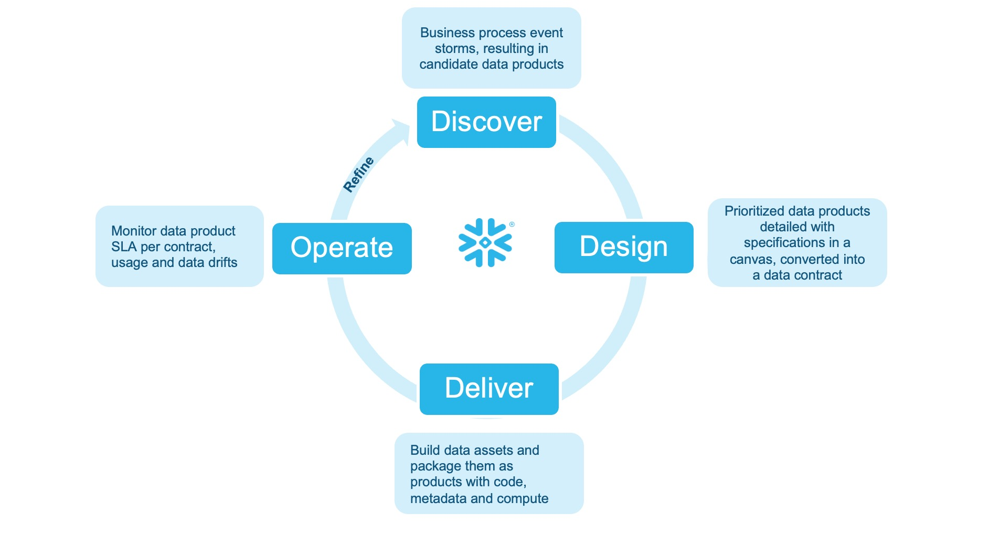

# Data Products for Financial Services

**Copy, Paste, Run & Done in 15 minutes!**

Build a production-ready **Retail Customer Churn Risk** data product on Snowflake — complete with AI-generated dbt models, masking policies, semantic views, and data quality monitoring.

> **Just run `setup.sql` as ACCOUNTADMIN and you're ready to go!**

---

## 🎯 What This Demo Creates

```
┌─────────────────────────────────────────────────────────────────────────────────┐
│                         DATA PRODUCT DELIVERY FLOW                               │
└─────────────────────────────────────────────────────────────────────────────────┘

    ┌──────────────┐     ┌──────────────┐     ┌──────────────┐     ┌──────────────┐
    │   CONTRACT   │     │  STREAMLIT   │     │  DBT MODEL   │     │    DATA      │
    │    (YAML)    │ ──▶ │   APP + AI   │ ──▶ │   + TESTS    │ ──▶ │   PRODUCT    │
    │              │     │   (Cortex)   │     │              │     │              │
    └──────────────┘     └──────────────┘     └──────────────┘     └──────────────┘
                                                                          │
                                                                          ▼
    ┌──────────────┐     ┌──────────────┐     ┌──────────────┐     ┌──────────────┐
    │   SNOWSIGHT  │     │  INTERNAL    │     │   SEMANTIC   │     │   MASKING    │
    │  DATA QUALITY│ ◀── │  MARKETPLACE │ ◀── │    VIEW      │ ◀── │   POLICIES   │
    │   DASHBOARD  │     │              │     │              │     │              │
    └──────────────┘     └──────────────┘     └──────────────┘     └──────────────┘
```

**End-to-End Flow:**
1. **Contract** → Machine-readable YAML defines schema, quality rules, SLAs
2. **Streamlit + Cortex AI** → Generates dbt model, schema, masking policies
3. **dbt Model** → Transforms raw data into churn risk scores
4. **Data Product** → `RETAIL_CUSTOMER_CHURN_RISK` table with 1,000 customers
5. **Governance** → Masking policies protect PII, semantic view enables AI queries
6. **Distribution** → Internal Marketplace listing for discovery
7. **Monitoring** → Native DMFs track freshness, completeness, quality

---

## 📊 Data Product Lifecycle

<p align="center">
  
</p>

| Stage | What Happens | Repo Folder |
|-------|--------------|-------------|
| **Discover** | Business event storms identify candidate data products | `01_discover/` |
| **Design** | Define specifications in a canvas, convert to a machine-readable data contract | `02_design/` |
| **Deliver** | Build data assets with code, metadata, and compute | `03_deliver/` |
| **Operate** | Monitor SLA, data quality, usage, and data drifts | `04_operate/` |
| **Refine** | Evolve with new features and versions | `05_refine/` |

---

## 🚀 Quick Start

**Prerequisites:** Snowflake account with ACCOUNTADMIN role.

### Step 1: Get the Code

```bash
git clone https://github.com/sfc-gh-skuppusamy/data-products-code-sample
```
*Or: Snowsight → Projects → Worksheets → Create from Git Repository*

### Step 2: Run Setup

Open `00_setup/setup.sql` in Snowsight and run:
- **Steps 1–4:** Creates database, schemas, warehouse, sample data (1,000 customers)
- **Step 5:** Creates Streamlit app (follow Option A)
- **Step 6:** Verifies all assets

### Step 3: Generate & Deploy

1. **Open Streamlit app:** Snowsight → Projects → Streamlit → `dbt_code_generator`
2. **Paste contract:** Copy `02_design/churn_risk_data_contract.yaml` → Click **Generate All Outputs**
3. **Deploy dbt model:** Create dbt Project in Snowsight → Add generated files → Compile & Run
4. **Apply governance:** Run `masking_policies.sql` and `03_semantic_view_marketplace.sql`

### Step 4: Setup Monitoring

Run `04_operate/monitoring_observability.sql` to enable Data Metric Functions.

### Step 5: Verify

| Check | Location |
|-------|----------|
| Data Product Table | Snowsight → Data → `RETAIL_BANKING_DB.DATA_PRODUCTS.RETAIL_CUSTOMER_CHURN_RISK` |
| Data Quality | Snowsight → Data Quality tab on the table |
| Marketplace Listing | Snowsight → Catalog → Internal Marketplace |

### Cleanup

```sql
-- Run 06_cleanup/cleanup.sql to remove all demo resources
```

---

## 📁 Repository Structure

```
├── 00_setup/                       # One-click setup script
├── 01_discover/                    # Data Product Canvas (HTML)
├── 02_design/                      # Data Contract (YAML)
├── 03_deliver/
│   ├── 01_dbt_generator_app.py     # Streamlit app (Cortex AI)
│   ├── generated_output_samples/   # Example outputs
│   └── 03_semantic_view_marketplace.sql
├── 04_operate/                     # Data Metric Functions
├── 05_refine/                      # Evolution example (v2 contract)
└── 06_cleanup/                     # Cleanup script
```

---

## 📋 What Gets Created

| Resource | Name | Description |
|----------|------|-------------|
| Database | `RETAIL_BANKING_DB` | Contains all schemas and data |
| Warehouse | `DATA_PRODUCTS_WH` | XS warehouse for compute |
| Source Tables | `CUSTOMERS`, `ACCOUNTS`, `TRANSACTIONS`, `DIGITAL_ENGAGEMENT`, `COMPLAINTS` | 5 raw tables with sample data |
| Data Product | `RETAIL_CUSTOMER_CHURN_RISK` | 1,000 customers with risk scores |
| Streamlit App | `dbt_code_generator` | AI-powered code generator |
| Semantic View | `retail_customer_churn_risk_sv` | Enables Cortex Analyst queries |
| DMFs | NULL_COUNT, DUPLICATE_COUNT, FRESHNESS, ROW_COUNT | Native data quality monitoring |

---

## 🔗 References

- [Snowflake Data Quality Docs](https://docs.snowflake.com/en/user-guide/data-quality-intro)
- [Snowflake Semantic Views](https://docs.snowflake.com/en/user-guide/views-semantic)
- [Data Metric Function Expectations](https://docs.snowflake.com/en/user-guide/data-quality-expectations)

